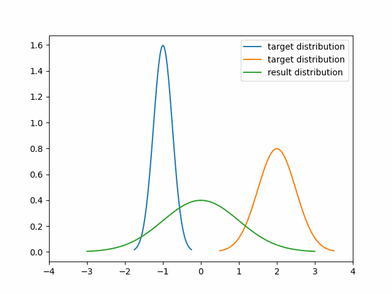
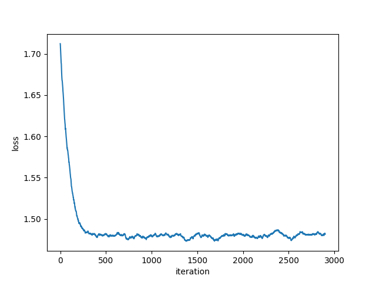
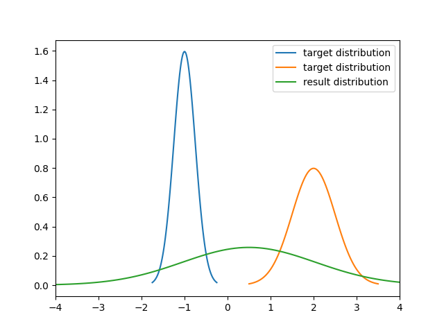
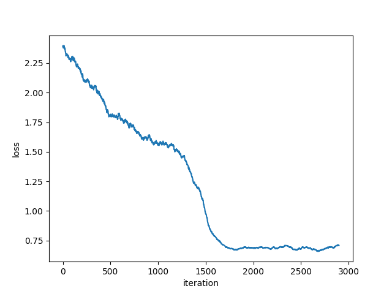
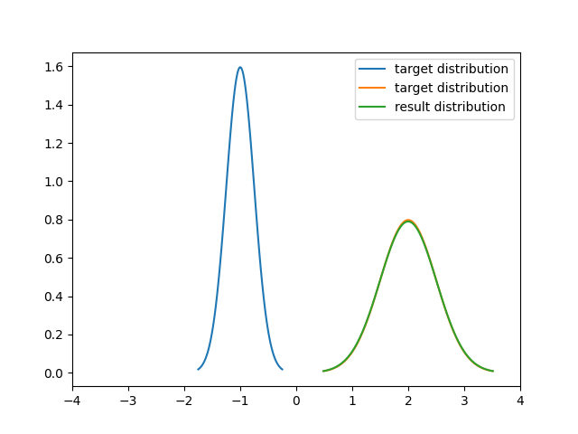

# Divergence Visualization

## Description
The project aims to visualize the divergence minimization problem in a 2D space. The user can choose different divergence measures, target distributions, and optimizer algorithms to visualize the minimization process.

## Installation
Install the required packages using the following command:
```bash
pip install -r requirements.txt
```

## Usage
1. The target gaussian distributions can be specified in the `target_distribution_config` file. Each row in the file represents a target distribution. The first column is the mean of the distribution, and the second column is the standard deviation. For example, the following line specifies two Gaussian distribution with mean 0 and 1, and standard deviation 1.
```
mu,std
0,1
1,1
```

2. Execute the following command to start the execution of the program:
```bash
python main.py
```
3. The following arguments can be used to specify the divergence measure, target distribution, and optimizer algorithm:
```bash
python main.py \
--distance_measure <divergence measurement> \
--sample_num <number of samples when meansuring the divergence> \
--iter_num <number of training iterations> \
--lr <learning rate> \
--optimizer <optimizer used to update the paramenter> \
```
Here are the different options for the arguments:
- `distance_measure`: The divergence measure used to measure the difference between the target and the generated distribution. The options are `fkl`, `rkl`, `jsd`, and `w2`.
- `optimizer`: The optimizer used to update the parameters. The options are `sgd`, `adam`.
More sample command can be found in the `run_code.sh` file.

## Results
The program will generate a loss curve, a result distribution, and a gif visualizing the divergence minimization process. These files will be saved in the `results` folder.
### result of fkl divergence minimization
* minimization process

* loss curve

* result distribution

### result of rkl divergence minimization
* minimization process

* loss curve

* result distribution



